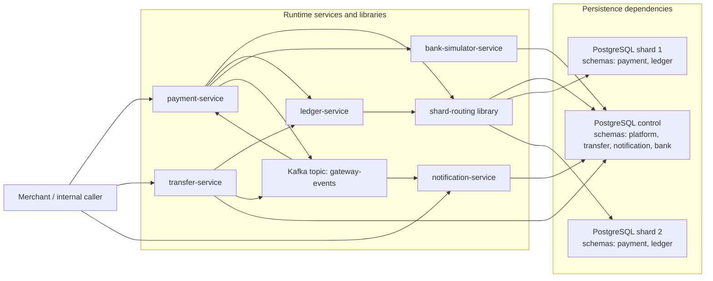
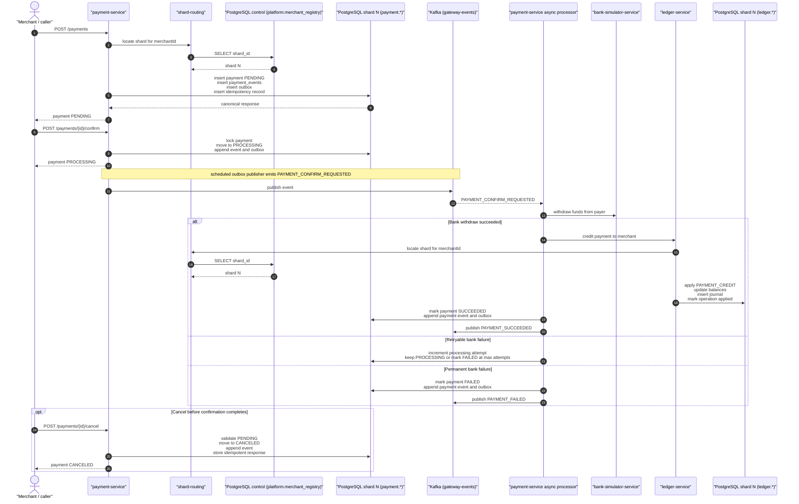
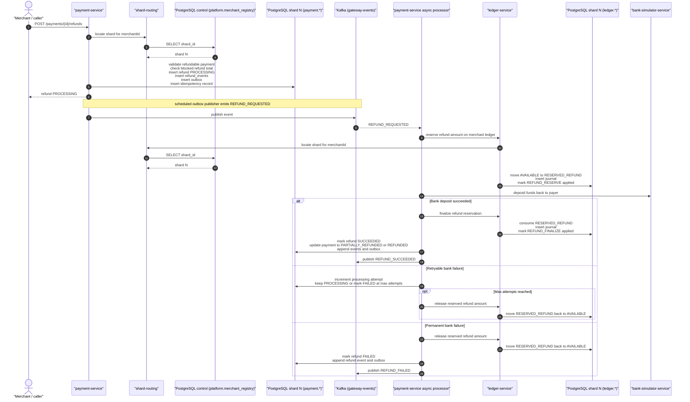
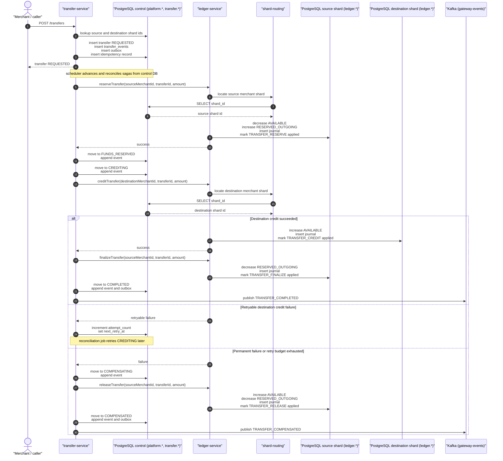
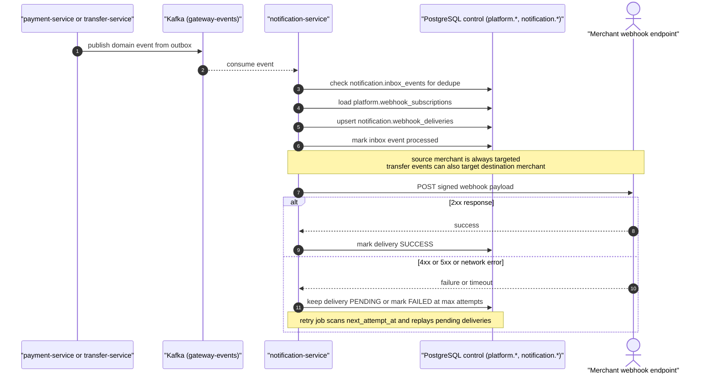
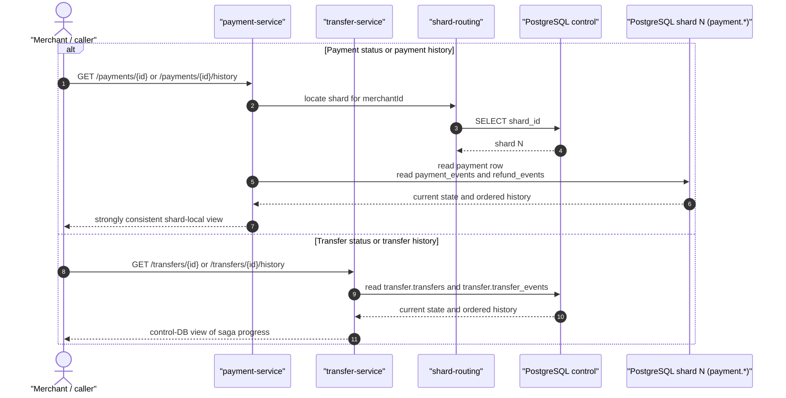

# Payment Gateway Workflow Diagrams

These diagrams describe the current implementation in this repository, not just the target architecture.

Redis is present in the `e2e-tests` environment, but it is not on the active runtime request path today.

## Persistence Ownership

| Component | Persistent dependency | Data owned in the current implementation |
| --- | --- | --- |
| `payment-service` | PostgreSQL shard 1 and shard 2 | `payment.payments`, `payment.refunds`, `payment.payment_events`, `payment.refund_events`, `payment.idempotency_records`, `payment.outbox_events` |
| `transfer-service` | PostgreSQL control | `platform.merchant_registry`, `transfer.transfers`, `transfer.transfer_events`, `transfer.idempotency_records`, `transfer.outbox_events` |
| `ledger-service` | PostgreSQL shard 1 and shard 2 | `ledger.accounts`, `ledger.operation_log`, `ledger.journal_entries` |
| `notification-service` | PostgreSQL control | `platform.webhook_subscriptions`, `notification.inbox_events`, `notification.webhook_deliveries` |
| `bank-simulator-service` | PostgreSQL control | `bank.transactions` |
| `shard-routing` | PostgreSQL control plus shard databases | looks up `platform.merchant_registry` and routes payment and ledger operations to the correct shard |
| `Kafka` | broker only | delivery backbone for outbox-published domain events |

## 1. Runtime Component Map

## 2. Payment Intent Workflow

## 3. Refund Workflow

## 4. Cross-Shard Transfer Saga

## 5. Notification And Webhook Delivery

## 6. Status And History Read Paths

